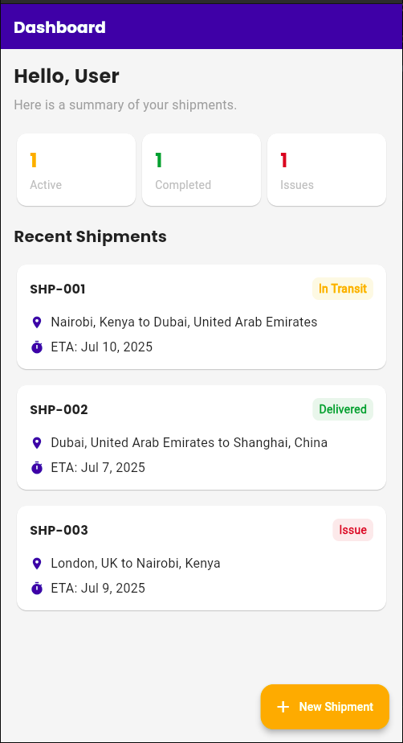
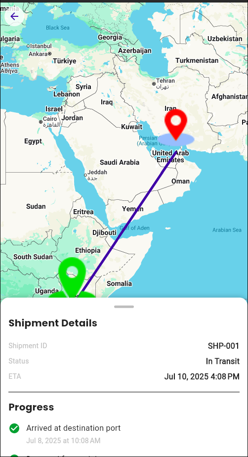

# LogisticsGo - Flutter UI & Architecture Showcase

LogisticsGo is a high-fidelity UI/UX prototype for a modern logistics application, built entirely with Flutter.

### Main Purpose

This project's primary goal is not to be a functional, production-ready application, but to serve as a **high-quality portfolio piece**. It is meticulously crafted to demonstrate:

  - The ability to translate a professional design specification into a pixel-perfect Flutter application.
  - Proficiency in building clean, intuitive, and modern user interfaces with custom widgets and layouts.
  - A deep understanding of scalable and maintainable app structure using **Clean Architecture** and the **BLoC** pattern.
  - Seamless integration with native device capabilities, specifically the **Google Maps SDK** for live shipment tracking.

-----

## Screenshots

 

-----

## Key Features

  - ✅ **Modern Authentication Screen:** A visually appealing, UI-only login screen with fields for email and password.
  - ✅ **Dashboard Hub:** A central screen displaying a welcome message, key shipment statistics (Active, Completed, Issues), and a list of recent shipments with their current status.
  - ✅ **Detailed Shipment Tracking:** The core UI showcase. It features an embedded Google Map that displays a polyline route from origin to destination, shipment details (ID, status, ETA), and a timeline view of the shipment's progress.
  - ✅ **Clean, Reusable Components:** The UI is built with a focus on reusable card-based components for consistency and scalability.

-----

## Tech Stack & Architecture

This project uses a modern, robust technology stack and follows Clean Architecture principles to ensure a clear separation of concerns.

### Architectural Layers

  * **Presentation:** Contains the UI (Screens/Widgets) and State Management (BLoCs). The UI reacts to states emitted by the BLoC, which calls use cases from the domain layer.
  * **Domain:** The core of the application. It contains the business logic (Use Cases), business objects (Entities), and repository contracts (abstract classes). It is written in pure Dart with no dependencies on Flutter or external packages.
  * **Data:** Implements the repository contracts from the domain layer. It is responsible for fetching data (from a Mock Data Source in this case) and converting data models to domain entities.

### Core Dependencies

| Dependency | Purpose |
| :--- | :--- |
| `flutter_bloc` | State Management |
| `get_it` | Service Locator / Dependency Injection |
| `Maps_flutter` | Map Integration |
| `dartz` | Functional Programming (for `Either` type error handling) |
| `equatable` | Value Equality for BLoC states/events and entities |
| `google_fonts` | Custom Typography |
| `intl` | Date/Time Formatting |

-----

## Folder Structure

The project follows a strict Clean Architecture folder structure.


-----

## Getting Started

Follow these instructions to get a copy of the project up and running on your local machine.

### Prerequisites

  - Flutter SDK installed (check with `flutter doctor`)
  - A code editor like VS Code or Android Studio
  - A Google Maps API Key

### Installation & Setup

1.  **Clone the repository:**

    ```sh
    git clone <https://github.com/EddieKe/logistics_go.git>
    cd logistics_go
    ```

2.  **Install dependencies:**

    ```sh
    flutter pub get
    ```

3.  **Set up the Google Maps API Key:**
    You need to place your API key in three separate locations for the app to work on Android, iOS, and Web.

      * **Android:**
        Open `android/app/src/main/AndroidManifest.xml` and add your key here:

        ```xml
        <meta-data android:name="com.google.android.geo.API_KEY"
                   android:value="YOUR_API_KEY_HERE"/>
        ```

      * **iOS:**
        Open `ios/Runner/AppDelegate.swift` and add your key here:

        ```swift
        GMSServices.provideAPIKey("YOUR_API_KEY_HERE")
        ```

      * **Web:**
        Open `web/index.html` and add the script tag with your key in the `<head>` section:

        ```html
        <script src="https://maps.googleapis.com/maps/api/js?key=YOUR_API_KEY_HERE"></script>
        ```

4.  **Run the application:**

    ```sh
    flutter run
    ```